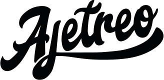

<div align="center">
  <a href="https://github.com/ajetreo">
    
	<br>
  <br>
</div>

## Documentation & Community

- [Documentation](https://design-system.ajetreo.co/)
- [GitHub Discussions](https://github.com/ajetreo/design-system/discussions)
- [GitHub Releases](https://github.com/ajetreo/design-system/releases)

## Install and use components

ADS is made up of multiple components and tools which you can import one by one. All you need to do is install the
`@ajetreo/design-system` package:

```sh
$ yarn add @ajetreo/design-system
# or
$ npm install --save @ajetreo/design-system
```

A working version, assuming you are using something like
[Create React App](https://github.com/facebookincubator/create-react-app), might look like this:

```js
import React from 'react'
import ReactDOM from 'react-dom'
import { Text } from '@ajetreo/design-styles'

ReactDOM.render(<Text>Hello!</Text>, document.getElementById('root'))
```

## Contributing to ADS

### 🍴 Step 1. Fork this repository

In order to contribute to ADS, you need to fork this repo, and develop on your own local clone.

If you don't know how to do so, follow this
[guide](https://help.github.com/en/github/getting-started-with-github/fork-a-repo)!

### 📖 Step 2. Get storybook up and running

First, move into your local cloned repository with the help of `cd`, after that install your `node_modules` with:

```sh
yarn
```

To actually start seeing the components you have to run React Storybook with the command:

```sh
yarn storybook
```

Now go to `http://localhost:6006` in your browser.

### 🛠 Step 3. Make your change

Now you can start developing! All of the components are under the `src` directory and associated code changes will
automatically be reflected in StoryBook.

If necessary, we encourage you to update the documentation so users will be aware of your new features/changes.

In order to run the documentation page locally, run these commands in your terminal:

```sh
yarn build
cd docs
yarn install
yarn storybook
```

Now you can visit `http://localhost:8000/` in your browser.

Documentation code is under the `docs` directory. A big portion of these docs are written in MDX, if you've never used MDX
before, check out these [docs](https://mdxjs.com/getting-started).

### 🏆 Step 4. Making your pull request

Once you're done with making your changes, push everything to your local repository's branch.

From here, you can open up a pull request from your forked repository's branch into `@ajetreo/design-system`'s `main` branch.

In your PR description, explain the changes you made, why you made them, how to test them, and anything that might be a point
of interest.

Once you create your PR, it will be reviewed and hopefully merged quickly!

### 🥂 Step 5. Congrats, you're officially a contributor!

The @all-contributors bot will open a PR adding you to the contributors section!

## 🤓 Scripts explained

Inside the `package.json` there are a bunch of scripts that this repo uses to run the project in development and to build the
project.

Below you can read a description of each script.

- `yarn dev`: Starts the development React Storybook.

- `yarn test`: Lints the JavaScript files using XO and then runs the unit tests using AVA.

- `yarn build`: Builds all of the JavaScript files using Babel.

- `yarn clean`: removes all untracked files (`git clean -Xdf`).

- `yarn release`: Releases new version of ADS (requires MFA via npm as a collaborator)

- `yarn create-package`: This command scaffolds a package with no specific boilerplate. It's useful for creating utilities.

For the following command:

```sh
yarn create-package utils
```

The following file tree will be generated:

```sh
/src/utils
├── /src/
└── index.js
```

- `yarn create-package:components`: This command scaffolds a package with React component(s) boilerplate.

You can pass one or more components to this command.

For the following command:

```sh
yarn create-package:components typography Text Heading
```

The following file tree will be generated:

```sh
/src/typography
├── /src/
|   │── Text.js
|   └── Heading.js
├── /stories/
│   └── index.stories.js
└── index.js
```

## 🎉 Contributors

Please take a look at the [Contributing Guide](.github/CONTRIBUTING.md) to better understand what to work on.

## 👏 Respect earns Respect

Please respect our [Code of Conduct](.github/CODE_OF_CONDUCT.md), in short:

- Using welcoming and inclusive language
- Being respectful of differing viewpoints and experiences
- Gracefully accepting constructive criticism
- Focusing on what is best for the community
- Showing empathy towards other community members
